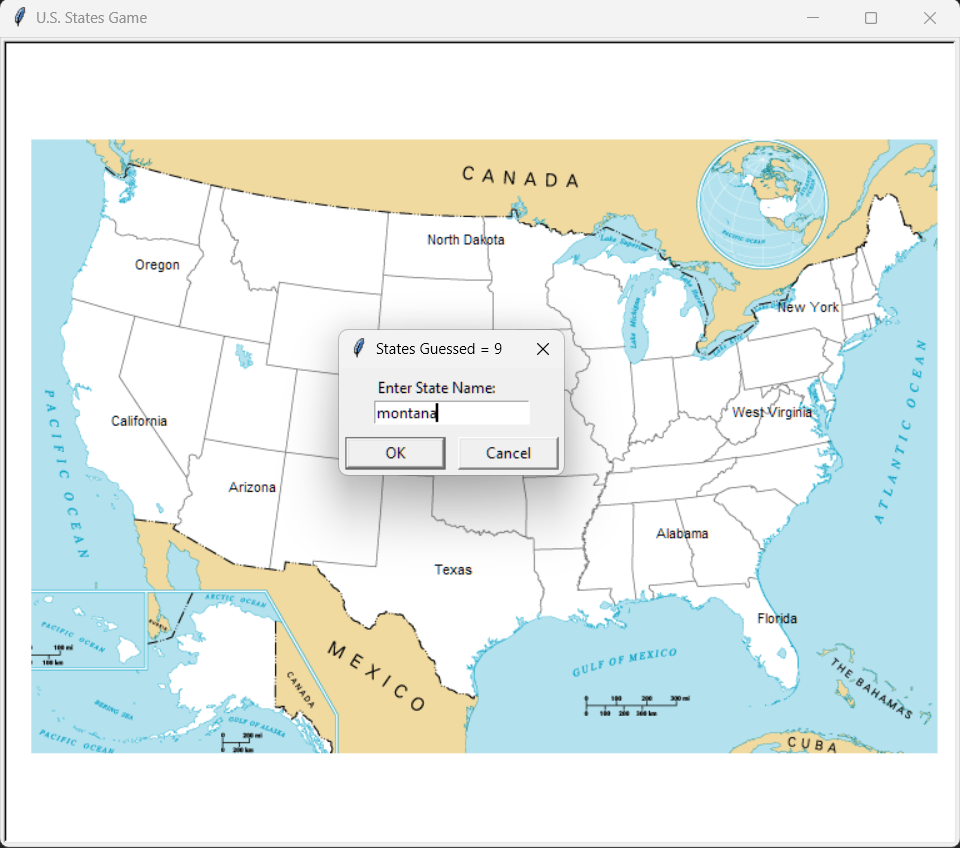

# 🇺🇸 U.S. States Guessing Game (Python)

A fun and interactive U.S. States guessing game built using **Python**, **Turtle Graphics**, and **Pandas**.  
The goal is to correctly guess all 50 U.S. states. Each correct guess is displayed at the correct position on the map.

---

## 🎮 How the Game Works

- A blank map of the United States is displayed
- The player types the name of a U.S. state
- If the guess is correct:
  - The state name appears at its correct location on the map
  - The score counter increases
- The game continues until all 50 states are guessed

---

## 📸 Screenshot



---

## 🛠 Technologies Used

- Python 3
- Turtle Graphics
- Pandas
- CSV file handling

---

## 📂 Project Files
```text
us-states-game/
├── main.py # Main game logic
├── 50_states.csv # State names and x,y coordinates
├── blank_states_img.gif # U.S. map image
├── assets/
│ └── screenshot.png
├── README.md
└── requirements.txt
```
---

## ▶️ How to Run the Game

1. Clone the repository:
```bash
git clone https://github.com/your-username/us-states-game.git
```
2. Navigate into the project folder:
```bash
cd us-states-game
```
3. Install dependencies:
```bash
pip install -r requirements.txt
```
4. Run the game:
```bash
python main.py
```
---

🧠 What I Learned From This Project

- Using Pandas to read and filter data from a CSV file
- Extracting single values from Pandas Series using .iloc
- Mapping real-world coordinates to a graphical interface
- Building an interactive game loop using Turtle

---

🚀 Possible Improvements

- Add a timer or score penalty for wrong guesses
- Save missed states to a CSV file at the end
- Make state name matching more forgiving (partial matches)
- Add an option to quit and show remaining states
